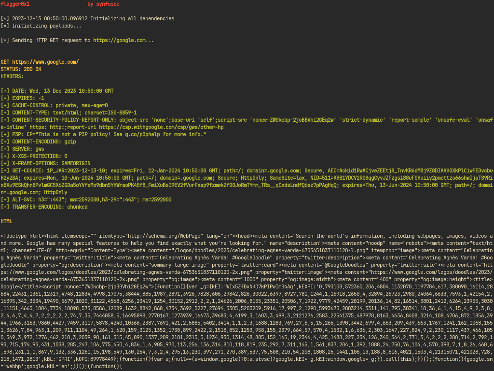

    <h1>flagger</h1>
    
Small CLI tool I made to dev exploits for CTF's

    

#### Features

- Exploit developement w/ [pwntools](https://github.com/Gallopsled/pwntools.git)
- HTTP GET/POST Requests

#### Setup

Install packages

`$ pip install -r requirements.txt`

Run script

`$ python flagger.py`

For usage read [wiki](https://github.com/synfosec/flagger/wiki)
